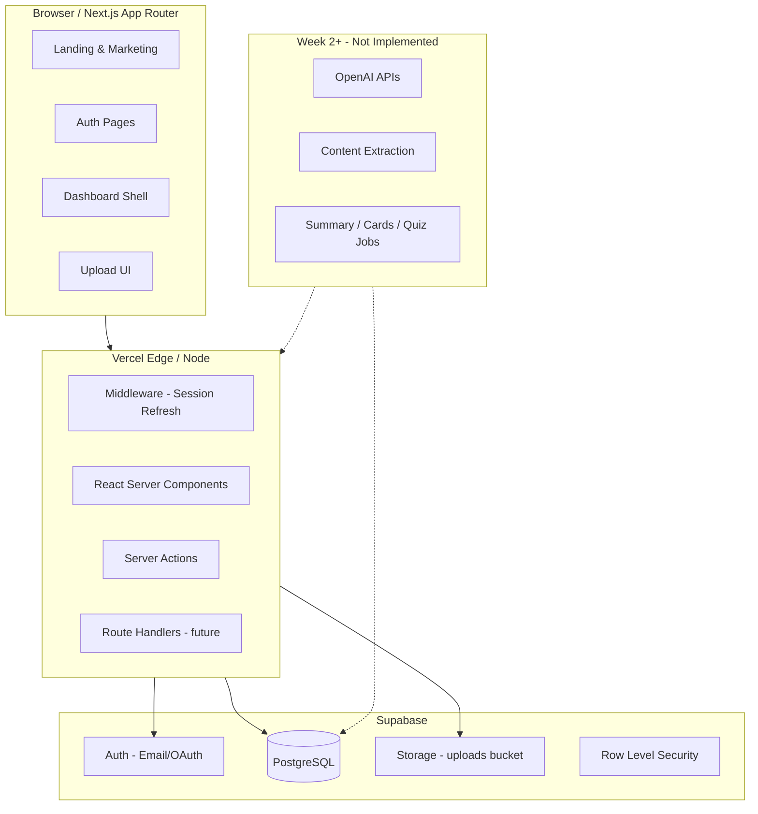

# StudySnap AI — System Architecture (Week 1)

## Overview

StudySnap AI is a student study assistant that ingests learning materials (photos, handwriting, screenshots, PDFs), extracts content, and produces summaries, flashcards, and quizzes. Week 1 establishes the application shell, authentication, data model, and upload UX—without AI pipelines.

## High-Level Architecture

## Layer Responsibilities

| Layer | Responsibility |
|-------|----------------|
| **Presentation** (`src/app`, `src/components`) | Routes, layouts, marketing, forms, dashboard chrome |
| **Application** (`src/features`) | Feature modules: auth, uploads, materials (domain UI + server actions) |
| **Domain** (`src/lib`, `src/types`) | Env validation, Supabase clients, shared types, utilities |
| **Infrastructure** (`supabase/`) | SQL migrations, RLS policies, storage configuration |

## Authentication Flow

1. User signs up or signs in via Supabase Auth (email/password in Week 1).
2. `@supabase/ssr` creates browser and server clients; middleware refreshes sessions on each request.
3. Protected routes under `(dashboard)` redirect unauthenticated users to `/login`.
4. Auth callback route exchanges OAuth/magic-link codes (ready for OAuth providers).

## Data Model (Week 1)

- **profiles** — extends `auth.users` with display name and plan tier.
- **materials** — uploaded file metadata (type, status, storage path).
- **study_outputs** — placeholder rows for future summaries/flashcards/quizzes (`status: pending`).

Upload flow (Week 1 UI only):

1. User selects files on `/dashboard/upload`.
2. Client validates type/size; Week 2 will call server action → Storage → `materials` insert.
3. `processing_status` remains `uploaded` until extraction jobs exist.

## Routing Strategy

| Segment | Purpose |
|---------|---------|
| `(marketing)` | Public landing, SEO-friendly layout |
| `(auth)` | Login, signup, password reset |
| `(dashboard)` | Authenticated app shell with sidebar |
| `auth/callback` | Supabase OAuth/email redirect handler |

## Scalability Decisions

1. **Feature folders** — Each domain (`auth`, `materials`, `uploads`) owns components and actions; avoids a monolithic `components/` dump.
2. **Server-first** — Dashboard data fetching via RSC; mutations via Server Actions (Week 2).
3. **RLS everywhere** — Users only access their rows; service role reserved for background jobs (future).
4. **Status enums** — `processing_status` and `output_type` as Postgres enums for consistent job orchestration later.
5. **Storage paths** — `{user_id}/{material_id}/{filename}` for isolation and lifecycle rules.
6. **Env validation** — Zod schema at startup prevents misconfigured deploys.

## Security (Week 1)

- No API keys in client bundles (`OPENAI_API_KEY` server-only).
- Middleware session refresh reduces stale JWT issues.
- CSP-friendly: no inline scripts beyond Next defaults.

## Deployment Target

- **Frontend**: Vercel (Next.js 15)
- **Backend**: Supabase (Auth, DB, Storage)
- **Future workers**: Supabase Edge Functions or Vercel background jobs for AI pipelines

## Week 2+ Extension Points

| Extension | Location |
|-----------|----------|
| OpenAI calls | `src/lib/ai/` (new) |
| Extraction jobs | `materials.processing_status` state machine |
| Study outputs | `study_outputs` + `src/features/study/` |
| Billing | `profiles.plan_tier` + Stripe webhook route |
| Rate limits | `upload_usage` table or Supabase RPC |

## Folder Structure

See [FOLDER_STRUCTURE.md](./FOLDER_STRUCTURE.md).
